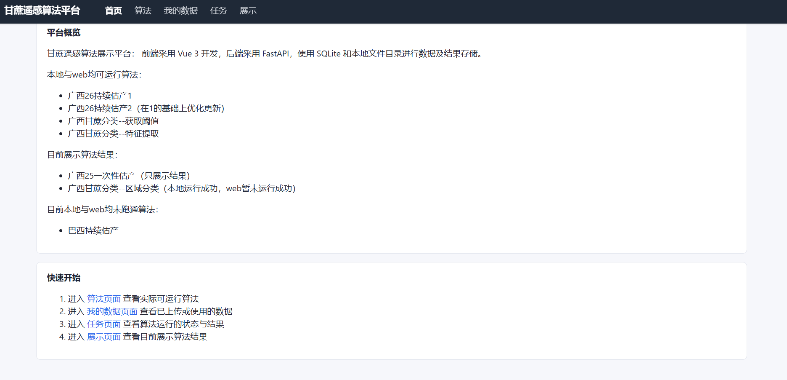
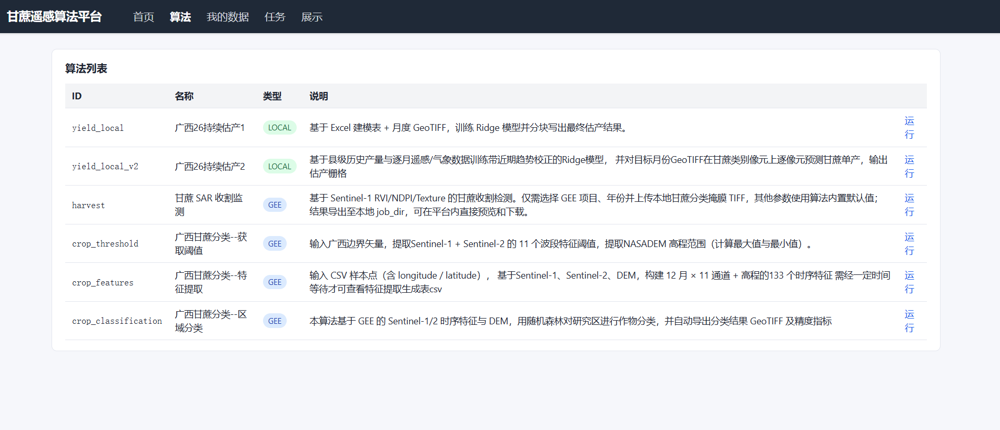
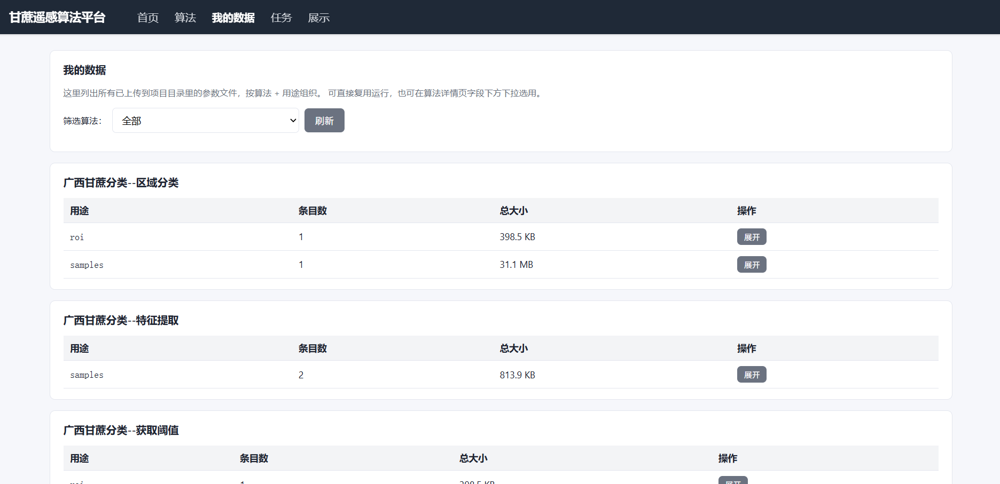
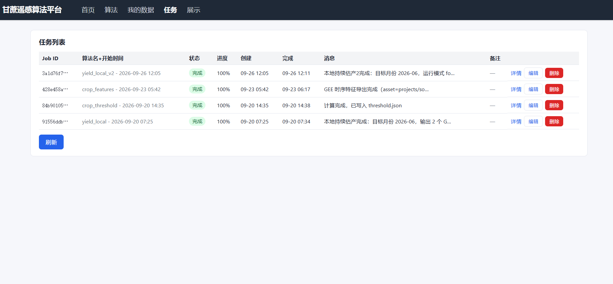
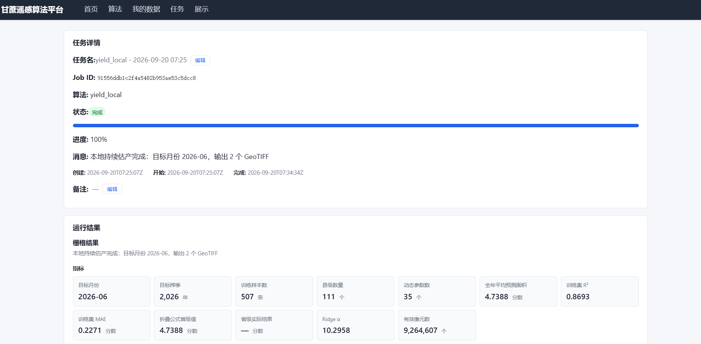
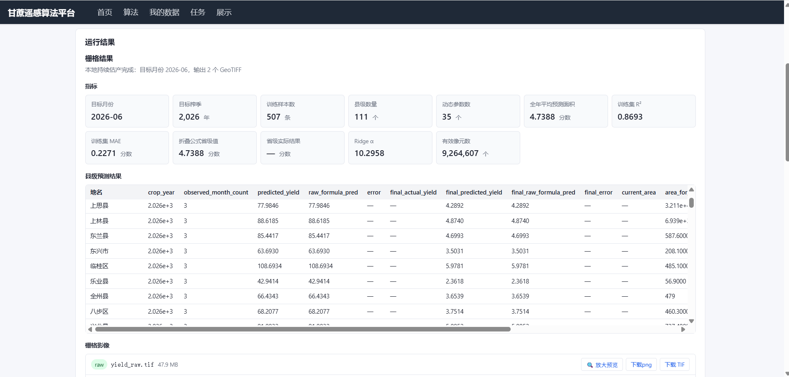
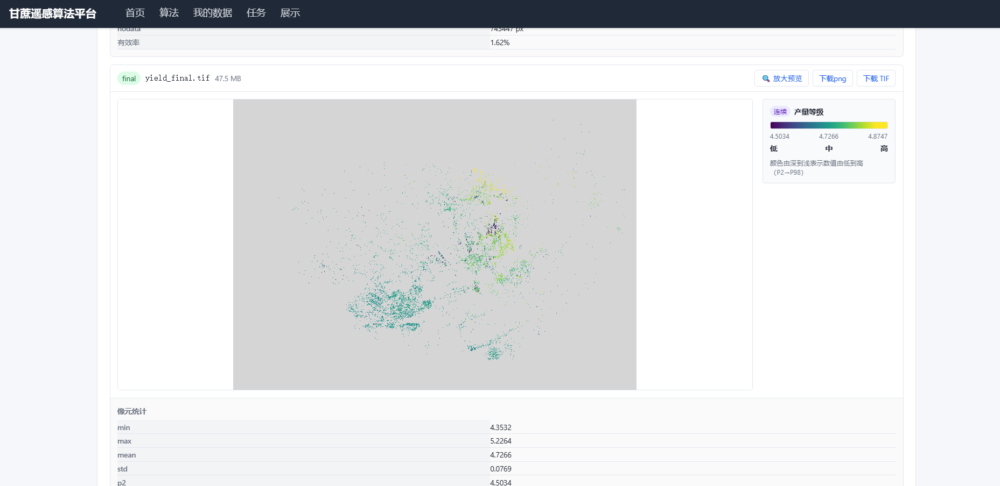
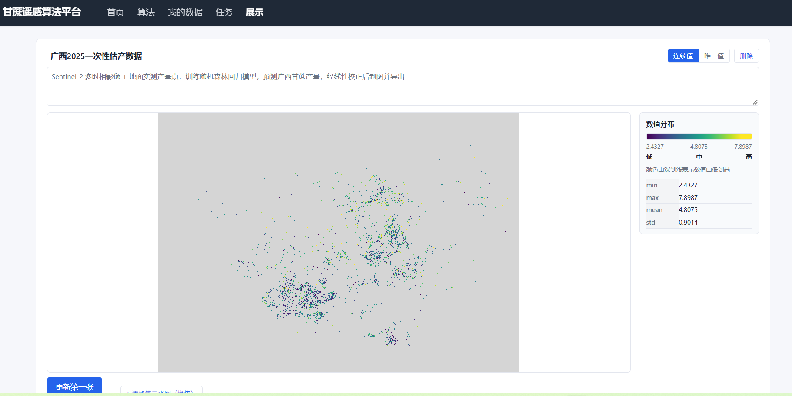
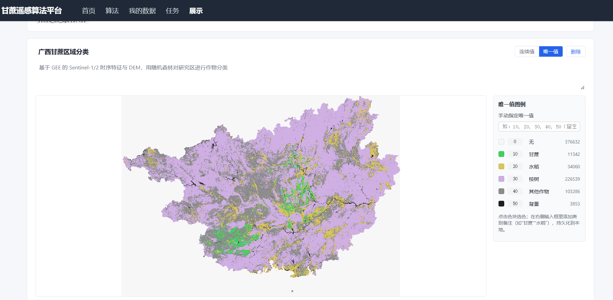

# Sugarcane Remote Sensing Platform 

甘蔗遥感算法 Web 平台。

## 结构

```
backend/   FastAPI 服务、算法注册表、任务存储
frontend/  Vue 3 + Vite 前端
```

## 启动

### 后端

```bash
cd backend
pip install -r requirements.txt
python -m uvicorn app.main:app --host 0.0.0.0 --port 8000 --reload
```

或使用脚本：`./run.sh` (Linux/macOS) / `run.bat` (Windows)。

### 前端

```bash
cd frontend
npm install
npm run dev
```

前端默认监听 `http://127.0.0.1:5173`，通过 vite proxy 把 `/api/*`
转发到后端 `http://127.0.0.1:8000`。


## 预览
## 首页

## 算法

## 我的数据

## 任务




## 展示1

## 展示2

